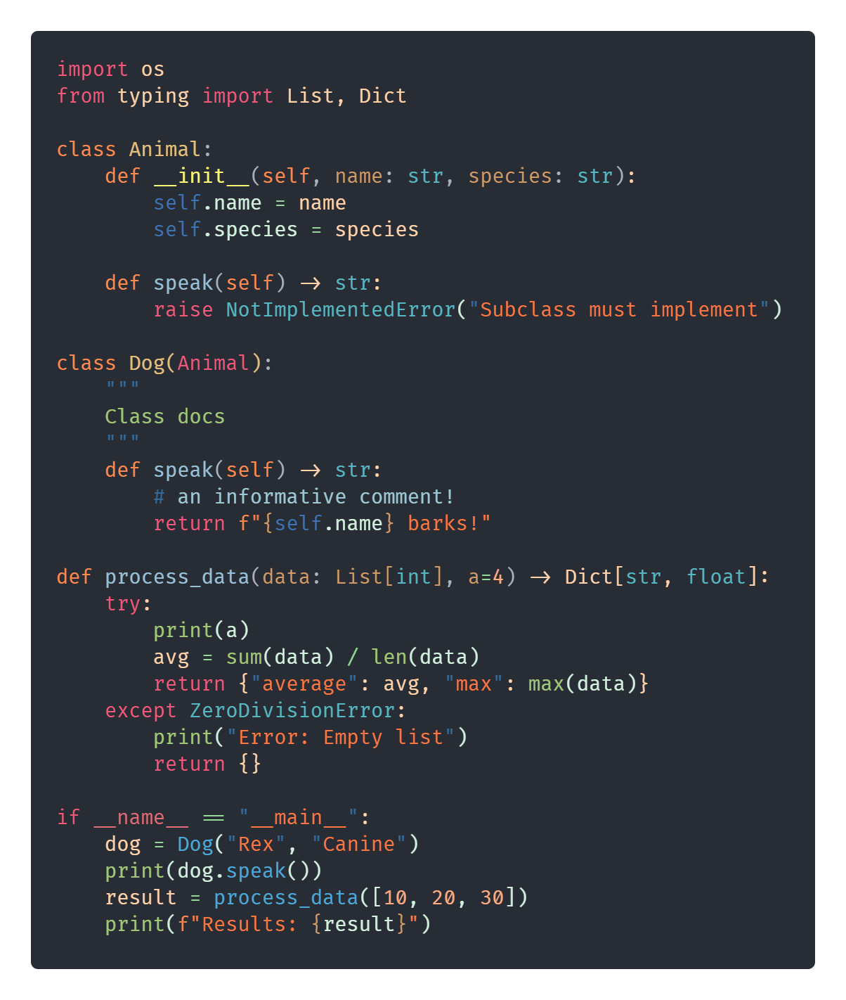
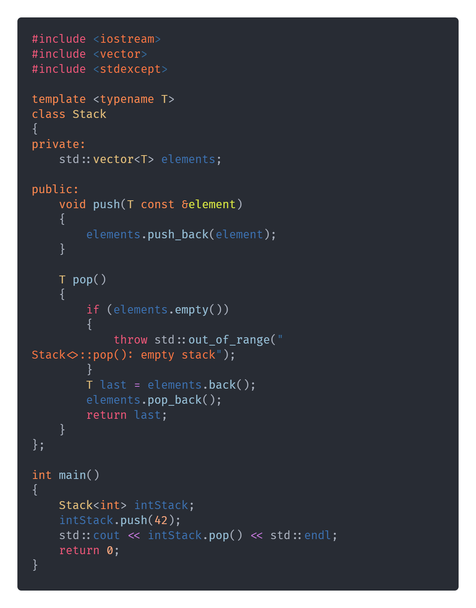
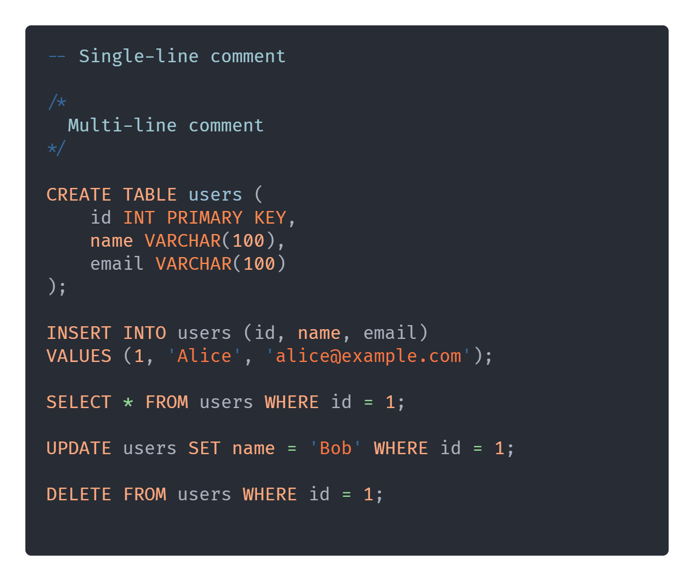
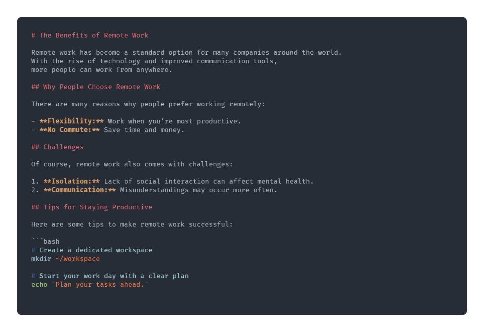

# 🎨 ColorFull

A vibrant, colorful theme for VS Code based on Atom's One Dark, with colorful syntax highlighting.  

For previews in other languages, **[CLICK HERE](#theme-previews)**

## About

A personal VS Code theme created just for fun.  
This theme is the outcome of tweaking different colors over time to suit my own style.  
It is mainly optimized for **Python**, so it may look different or incomplete in other languages.

## Credits

This project is heavily based on:

- **[Atom One Dark Theme](https://github.com/akamud/vscode-theme-onedark/tree/master)** by [akamud](https://github.com/akamud) - [MIT License](LICENSE.original)

---

## Installation

> **Note:** For best experience, use with **[Fira Code](https://github.com/tonsky/FiraCode)** font.

1. Download or clone this repo
2. Place the folder in your VS Code extensions directory:
   - **Windows**: `%USERPROFILE%\.vscode\extensions`
   - **macOS/Linux**: `~/.vscode/extensions`
3. Restart VS Code and select `ColorFull` as your theme.

## Theme Previews

Here are some previews of this theme in different languages:

|  |  |
|----------|---------|
| **Python** |  |
| **JavaScript** |  |
| **C++**    |  |
| **Java**    |  |
| **SQL**    |  |
| **HTML**   |  |
| **CSS**    |  |
| **JSON**    |  |
| **Markdown**    |  |
